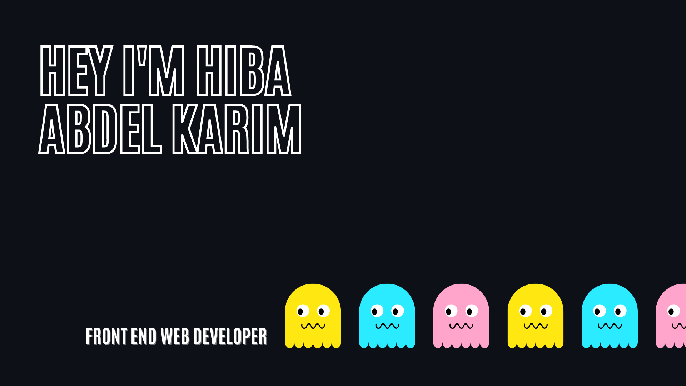

# Good to see you here 
  

# About me 
- Full Stack Web Developer @ Logisoft mainly focused on Front End
- Front End coding bootcamp graduate
- Computer science student
- Beside coding? I wanna be a writer who reads 100 book a day! :star2:
- Born and raised in Lebanon

# What I am up to 
- Currently I'm taking the full stack path in Frontend Masters learning the fundamentals for the backend such as database, database design, Api Designs, Linux command line and AWS for Frontend Engineers. All using Node.js language.

# Technologies and skills
         

📫 R𝚎𝚊𝚌𝚑 𝚖𝚎 by email:
abdelkarim.hiba@outlook.com
